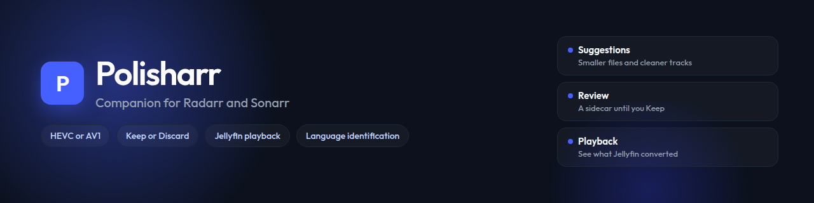

# Polisharr



Polisharr is a companion container for Radarr and Sonarr. It inspects the same library those apps already know, suggests smaller HEVC (or AV1) files and cleaner tracks, and writes a sidecar you Keep or Discard before the library file changes. It can listen to an untagged soundtrack or read untagged subtitles to name the language, and it can watch Jellyfin so a player conversion is visible and playback can hold encodes and file replacement. Custom title plans, ISO remux, and optional direct write are also supported.

This tree is a greenfield rewrite. Do not import the previous application code.

**PRD:** [docs/v2 prd.md](docs/v2%20prd.md) (v2). The rewrite PRD is [docs/prd.md](docs/prd.md).
**Plans:** multi-node (one master, extra GPU boxes): [plans/multi-node.md](plans/multi-node.md). Same-volume Keep and clone: [plans/native-fs-copy.md](plans/native-fs-copy.md). Jellyfin playback and Review clips: [plans/playback-and-review.md](plans/playback-and-review.md). Shipped v2 work: [plans/v2-implementation-plan.md](plans/v2-implementation-plan.md). Finished follow-ups: [plans/review-follow-up.md](plans/review-follow-up.md) and [plans/review-gap-remediation.md](plans/review-gap-remediation.md).
**Engineering standard:** [ENGINEERING_STANDARDS.md](ENGINEERING_STANDARDS.md)
**Prose standard:** [CODING_STANDARDS.md](CODING_STANDARDS.md)

## What it does

- Syncs movies from Radarr and episodes from Sonarr over their APIs
- Refreshes Arr libraries at startup, every 15 minutes, on request, and when Radarr or Sonarr posts a webhook after import
- Opens the network path each Arr reports
- Inspects MKV with ffprobe and ISO disc images with ffmpeg. Blu-ray remux copies the feature video and usable audio, copies playlist languages onto the Matroska file, ignores dummy AC3 decode errors, and skips audio-only menu listings. A BR-DISK image is opened with the bluray protocol. A stale ISO listing (the file treated as a lone AC3 stream) is listed again before the next remux. Titles with no file yet stay off Errors. A file that ends well before its inspected duration is rejected and left off Review. Optional Suggestions can convert ISO to MKV. A title whose only audio is not your preferred language can ask Radarr or Sonarr to search again after you confirm.
- Flags files over the GB-per-hour cap, extra languages, and missing AAC stereo
- Can suggest converting MP4 files to MKV before a hardware encode, or as remux-only work
- Filters Suggestions by media facts or warning state and manages path, profile, tag, and title exclusions
- Lets you queue a custom plan from a title page: track edits, remux, size mode, or encoder quality. The title page shows file name and path. Queue stays off until the plan differs from the source. AV1 appears when an encode node can encode it. The library file does not change until Keep.
- Names an untagged soundtrack by listening to a 45-second clip, and an untagged subtitle by reading three minutes of words. Picture subtitles (PGS) use a short OCR sample. You confirm the language before it is saved. A weak sample stays untagged. A file whose only soundtrack is untagged keeps that track. Details: [Identify Unknown Languages](#identify-unknown-languages).
- Watches each Jellyfin connection you opt in, and lists player conversions on Playback. It can hold new encodes on the GPUs you map, and wait to replace a file someone is watching. Plex connections refresh the library after Keep. Details: [Jellyfin Playback](#jellyfin-playback).
- Movie and episode rows can Queue, Force a suggestion, add stereo, Exempt a file from the size cap, ask Radarr or Sonarr to replace the file, or stop tracking that title. Two episodes that share one file share one job and one Review card.
- Suggestions can queue the next 10 in the current sort, queue every match in the current search and filters, or queue the rows you check. Titles already queued or in Review are skipped.
- Home shows a Status strip, files-optimized and space-saved tiles, a 12-week space-saved chart, and links into Suggestions, Queue, Review, and Errors. History lists finished work. Direct write counts in the tallies the same way Keep does.
- Settings uses stacked labels and everyday size-cap names. Title-page audio actions keep a fixed-width dropdown so Keep and Replace with downmix do not jump.
- Series headers show episode total, how many are healthy, and how many still have suggestions. Movies shows the same three counts for the whole Radarr library, not just the loaded page.
- Lets a movie or a whole show pick HEVC or AV1 for automatic Suggestions without changing the house Encode Target. A series header can Prefer stereo (replace surround with a downmix and discard included stereo, including 5.1 kids shows) or Keep surround.
- Suggestion, Errors, and Queue titles open the same detail page as Movies and Series
- Queue pins running jobs in Working now, then waiting jobs, then finished jobs, so a long batch does not hide the encode in progress. Hold jobs outside off-peak keeps new work queued until that window. Run now starts one of those jobs outside the window, and still waits while Jellyfin playback protection is on.
- Size-mode encode reserves room for copied audio. A file within 5% of its GB-per-hour cap counts as meeting it.
- Muxes tracks with MKVtoolnix and encodes video with the GPU or Mac media engine you pass in. mkvmerge and ffmpeg run with a UTF-8 locale so titles such as 烧烤 are not truncated.
- Writes a sidecar for Review by default, or replaces the library file after an integrity check when **Write finished files** is Direct write. Waiting bulk jobs use that setting when they start. Queue new Arr imports uses the choice under that checkbox: a Review sidecar, that same setting, or a direct replace after the integrity check. Keep then asks Radarr or Sonarr to refresh media info and rename the library file so tokens such as `EAC3 5.1` or `H264` match the new audio and video.
- Lets you Keep one sidecar, Keep selected, or Keep all waiting sidecars after a confirm. Flagged results can queue a smaller encode. Review shows duration and GB per hour. Keep selected reports how many were skipped. Compare clips plays matching samples of the original and the finished file after you pick a position. Opening Review does not start that work. The browser pair is a scaled picture with AAC stereo (surround downmixed) and HDR shown as SDR. The pair supports the Keep decision.
- Checks review-volume free space before work. After restart, interrupted jobs return to the queue. Interrupted Keep cards return to Review so you can retry or discard them. A Keep that already replaced the library file counts as kept.
- Can create or repair Polisharr-named Arr quality profiles from the current size caps. Auto-assign applies only after a video transcode and never starts a search.

## Installation

Polisharr runs as a Docker container next to Radarr and Sonarr. It reads the same library files those apps already know, so the media bind in compose must be that path on both sides. Video encode needs hardware: NVIDIA (NVENC), Intel or AMD (VAAPI, the Video Acceleration API), or an M-series Mac media engine (VideoToolbox). There is no CPU encode fallback. Docker on a Mac cannot reach VideoToolbox; run the native process in [Apple Silicon (M-series)](#apple-silicon-m-series).

### 1. Get compose

```bash
git clone https://github.com/charlesgreever/polisharr.git polisharr
cd polisharr
```

The running image is `ghcr.io/charlesgreever/polisharr:latest` (a version tag such as `v0.2.57` matches that GitHub release). GitHub Actions builds that image when a `v*.*.*` tag is pushed.

### 2. Copy and edit compose

Copy [compose.example.yaml](compose.example.yaml) to `compose.yaml`. Change these values:

- **Media bind.** `/path/to/media:/path/to/media` must match the file path Radarr and Sonarr report. If they see `/mnt/media/Movies/Title.mkv`, both sides of the bind are `/mnt/media`.
- **`PUID` / `PGID`.** Owner of `/config` and files Polisharr writes. Use the same ids as your Arr containers.
- **`TZ`.** Container timezone.

NVIDIA is already selected (`runtime: nvidia` and the `NVIDIA_*` variables). The host needs the NVIDIA container toolkit. `utility` provides `nvidia-smi`. `video` provides NVENC.

For an Intel GPU, comment out `runtime: nvidia` and the `NVIDIA_*` variables, then uncomment `devices: /dev/dri`. ffmpeg uses `/dev/dri/renderD128`. Set `group_add` to the host `render` and `video` group ids (`getent group render video`). The entrypoint keeps those groups after it drops root; otherwise VAAPI fails with `Device creation failed: -22`.

An M-series Mac does not use this Linux image for encode. See [Apple Silicon (M-series)](#apple-silicon-m-series).

If Radarr and Sonarr already share a Docker network, attach Polisharr to that network so Settings can use `http://radarr:7878`.

### 3. Start

```bash
docker compose pull
docker compose up -d
```

Recreate the container after you change GPU settings. To compile this tree instead of pulling, uncomment `build: .` in compose and run `docker compose up -d --build`.

### 4. First run

Open `http://localhost:7373` (or the host address you published). Create the admin account. Polisharr then collects preferred language, a review folder (where finished copies wait for Keep, outside movie and show libraries), and at least one enabled Radarr or Sonarr. Put that review folder on the **same share** as Movies and TV so Keep can rename on that volume. Plex and Jellyfin library refresh can wait; add them later in Settings. Jellyfin playback observation stays off until you turn it on ([Jellyfin Playback](#jellyfin-playback)). Optional: add a webhook so new imports show up immediately ([Webhooks from Radarr and Sonarr](#webhooks-from-radarr-and-sonarr)). The sidebar shows the running version from `package.json`.

Under **Default suggestion operations**, **Convert MP4 to MKV** is off by default. When enabled, Polisharr uses `mkvmerge` to create an MKV before any hardware encode. An MP4 that needs no other work gets a remux-only suggestion.

| Variable | Default | Purpose |
| --- | --- | --- |
| `PUID` / `PGID` | `1000` | Owner of `/config` and files Polisharr writes |
| `TZ` | `UTC` | Container timezone |
| `CONFIG_DIR` | `/config` | Persistent SQLite and settings |
| `PORT` | `7373` | Listen port |
| `POLISHARR_WIDGET_KEY` | unset | Optional Homepage widget key |
| `POLISHARR_TRUST_PROXY` | unset | Set to `1` only behind a trusted reverse proxy |
| `POLISHARR_ROLE` | `standalone` | `standalone` (one box), `master` (UI and library), or `worker` (encode only) |
| `POLISHARR_NODE_NAME` | hostname | Label in Settings → Nodes and the Encode node picker |
| `POLISHARR_MASTER_URL` | unset | Worker only: URL of the master, for example `http://192.168.1.10:7373` |
| `POLISHARR_CLUSTER_TOKEN` | unset | Shared secret. Generate it on the master; set the same value on each worker |
| `WHISPER_LID` | `/usr/local/bin/whisper-lid` in compose and the image | Command that listens to an untagged soundtrack. Unset hides audio Identify language |
| `PGS_OCR` | `/usr/local/bin/pgs-ocr` in compose and the image | Command that reads a PGS subtitle sample. Unset leaves picture subtitles unread |

## Encode target and preferred audio

Settings **Target** under Encode is the house codec for automatic Suggestions: HEVC, or AV1 when an encode node can encode it. **Transcode video below Target Encode** flags H.264, MPEG-2, VC-1, and similar codecs even when the file is under its size cap. When the target is AV1, it also flags HEVC. Already-AV1 files stay as they are.

Each movie row and that movie's title page have **Encode target**. Pick HEVC, AV1, or **House default** to follow Settings. Saving recomputes the automatic suggestion for that film. The Codec control on a custom title plan is only for the job you queue there.

A series header has the same **Encode target**. It applies to every episode of that show, including files Sonarr imports later. Episode rows have no codec dropdown.

Series headers also have **Preferred audio**:

- **House default** follows Settings **Add stereo from surround audio**. When that box is on, Polisharr adds an AAC stereo track to any surround layout that has no stereo track in your preferred language, including ordinary 5.1, and keeps the original mix.
- **Prefer stereo** replaces surround with AAC stereo on every episode, including 5.1 kids shows, and drops the original mix. When surround is present, Polisharr always builds that stereo from the surround mix and discards a stereo track that was already on the file (commentary or otherwise).
- **Keep surround** turns automatic stereo off for that show.

Add stereo on a row still works for one episode. Queue still writes a sidecar. Keep still replaces the library file.

## Identify Unknown Languages

Untagged audio and subtitles (`und` or unknown) are otherwise offered for removal. A file whose only soundtrack is untagged keeps that track, so cleanup cannot silence it. A lone untagged subtitle stays too. On the title page, **Identify language** names the track before you decide. **Use** saves the language on the inspection and refreshes Suggestions. The library file keeps the old tag until Keep or a direct write replaces it.

The image and [compose.example.yaml](compose.example.yaml) set `WHISPER_LID=/usr/local/bin/whisper-lid` and `PGS_OCR=/usr/local/bin/pgs-ocr`, so those buttons are available in Docker. Clear a variable to hide that button. A native macOS or `npm start` process needs the same paths. When a path is missing, the title page names the missing tool and hides that button. Each sample starts at 1:30 on a long file, and at the beginning when the file is shorter.

**Audio.** Identify language extracts a 45-second clip. `whisper-lid` runs faster-whisper with the tiny model. The first listen downloads that model into `/config/whisper`. An NVIDIA GPU is tried first (CUDA). When CUDA is missing, the same clip runs on CPU. Polisharr shows the language and a confidence percent. Below 75% confidence, or a clip with no speech, the track stays untagged and you can listen again at another time.

**Text subtitles.** SRT, ASS, WebVTT, and similar text tracks need no extra program. Polisharr extracts three minutes as SubRip and reads the words. A thin sample stays untagged. **Use** saves the language on that track.

**PGS.** These subtitles are pictures. When `PGS_OCR` is set, Identify language reads up to 24 images from a three-minute sample with Tesseract’s English model, then guesses the language from that text. Polisharr saves a language tag and leaves the PGS pictures in the file. VobSub and DVB subtitles stay unread.

## Jellyfin Playback

A Jellyfin connection can refresh that library after Keep, the same way a Plex connection can. Playback monitoring is a separate switch and stays off until you check **Observe playback** on that Jellyfin connection. **Test playback access** needs a Jellyfin server API key. A login that cannot see household sessions fails that test. Use a server API key so Polisharr can see those sessions.

Polisharr asks Jellyfin about current sessions about every 10 seconds. Each observation stores the title, player name, time, playback method, and the conversion reason Jellyfin reported. It stores the device name and viewing time, and it omits usernames and IP addresses. **Keep viewing history** can be off while live protection stays on. **Clear viewing history** deletes stored observations and dismissed recommendations.

Playback has two views, with filters for title, player, Jellyfin connection, reason, and the last 7 or 30 days:

- **Recent problems** lists conversions. A viewing does not queue work. **Open repair plan** opens a custom plan you still queue yourself. When the file already has a playable stereo track, the card tells you to choose that soundtrack in Jellyfin. A surround file with no preferred-language stereo can open a plan that adds AAC stereo and keeps the original mix. A video or subtitle conversion explains Jellyfin’s report. Polisharr leaves the codec and the subtitle tracks for you to choose. A bitrate limit points at an existing size suggestion when one exists, and leaves the target alone when none exists.
- **Recent observations** lists what Jellyfin reported, including direct play.

After Keep, a later direct play on the same device can read “Direct playback observed on this device after Keep.” With no matching viewing yet, the line stays “Not yet observed.” Unmatched playback and a stale connection stay on Playback. They stay off Errors.

**Let Jellyfin playback take priority** holds new work on the encode nodes you check while that server is playing video, including direct play. A job already running finishes. Paused video releases those nodes after the idle cooldown. The file stays protected while Jellyfin still lists it as the current item. **Run now** still waits for this hold. When Jellyfin cannot be reached, mapped nodes stay held until a poll succeeds.

**Protect file replacement** waits to replace a library file in the Radarr or Sonarr libraries you check while someone is watching that file. A finished direct write then waits in Review until playback ends. The original file stays until that replacement runs. Notifications can say “Polisharr will replace it when playback ends.”

## Extra GPU boxes

One Polisharr is the **master**: UI, settings, library sync, Suggestions, Review, and Keep. Put that container on the always-on host next to Radarr and Sonarr. Set `POLISHARR_ROLE=master`. Each extra GPU box is a **worker**: it only runs encodes. Copy [compose.worker.yaml](compose.worker.yaml), give it its own `/config`, and bind the **same** media path the Arrs report (and the same review folder). An M-series Mac worker is a native process, not that Linux compose file.

**Encode target** is still HEVC vs AV1. **Encode node** is which machine runs ffmpeg. Settings → Nodes sets the house default and per-node job slots. Queue, Suggestions, and the title page can pick a different node for one job. If that node is off or drained, the job waits; it does not move to another GPU. Settings can Remove a worker that will not come back; this computer stays. Move or cancel that node’s waiting jobs first.

On the master, Settings → Nodes generates a cluster token. Copy it once into `POLISHARR_CLUSTER_TOKEN` on the worker, with `POLISHARR_MASTER_URL` pointing at the master. Do not share `/config` or `polisharr.db` across containers. Webhooks still hit the master.

A worker writes a sidecar on the shared review path. Direct write still replaces the library file on the master after the integrity check, then refreshes Arr. Queue new Arr imports uses the finish choice in Settings and the house encode node.

The worker's published port is only a stub page (hardware, master URL, join status). Open the master to manage the library.

## Review folder and Keep speed

Keep is fast when the review folder and the library live on the **same volume**. Polisharr then renames the sidecar onto the movie path. If they sit on different disks or shares, Keep copies the whole file.

Settings shows **Keep can rename on this volume** or **Keep will copy**. Put `review-path` next to `Movies` on the same SMB share, ZFS dataset, or Windows drive. Do not put it inside a movie or show folder.

| Setup | Notes |
| --- | --- |
| Synology, QNAP, TerraMaster, ZimaOS | One share for media and review. Btrfs/ZFS can clone when rename is not possible. |
| TrueNAS | Same dataset. Cross-dataset clone can fail; Keep then copies. |
| Unraid `/mnt/user` | FUSE often blocks rename across shares. Use the same user share, or bind `/mnt/cache` for a cache-only library. |
| Windows | Same drive letter / volume. ReFS clones; NTFS usually copies after rename fails. |
| Two NAS boxes | Keep copies. That is expected. |

Workers still write the sidecar onto that shared review folder. Keep always runs on the master. Details: [plans/native-fs-copy.md](plans/native-fs-copy.md).

## Apple Silicon (M-series)

VideoToolbox is the macOS media engine on M-series Macs. ffmpeg uses it for hardware HEVC (and AV1 when that Mac lists `av1_videotoolbox`). Docker Desktop, Colima, and Lima run a Linux VM, so a Polisharr container on a Mac never sees that engine. Encode jobs then fail closed. Polisharr does not start a CPU encode.

Run Polisharr as a native macOS process. Typical layout: the master stays in Docker next to Radarr and Sonarr, and the Mac is a worker that mounts the same media path.

```bash
brew install ffmpeg mkvtoolnix node
git clone https://github.com/charlesgreever/polisharr.git polisharr
cd polisharr
npm ci
npm run build
```

On the master, Settings → Nodes generates a cluster token. Then:

```bash
export POLISHARR_ROLE=worker
export POLISHARR_NODE_NAME="Mac Studio"
export POLISHARR_MASTER_URL=http://192.168.1.10:7373
export POLISHARR_CLUSTER_TOKEN=the-token-from-the-master
export CONFIG_DIR="$PWD/config-worker"
export HOST=0.0.0.0
export PORT=7374
./scripts/run-macos.sh
```

The script checks that this is macOS and that ffmpeg lists `hevc_videotoolbox`. It points `FFMPEG` / `FFPROBE` / `MKVMERGE` at the Homebrew binaries. Give the worker its own `CONFIG_DIR`. Bind or mount the same Arr library path and review folder the master uses (SMB, NFS, or a local copy of that tree). Settings → Nodes should then show **Apple media engine**.

To run the whole app on the Mac (standalone), omit `POLISHARR_ROLE` and open `http://127.0.0.1:7373`.

## Run locally

```bash
npm install
npm test
npm run dev
```

The API listens on `http://127.0.0.1:7373`. The Vite UI listens on `http://127.0.0.1:5173`.

```bash
npm run build
CONFIG_DIR=./config npm start
```

## Webhooks from Radarr and Sonarr

Polisharr already syncs Radarr and Sonarr every 15 minutes. A Connect webhook tells it about a finished import right away so the new file is inspected without waiting. The webhook itself does not start an encode. Optional: **Queue new Arr imports automatically** in suggestion defaults queues the suggestion when inspect produces one. The choice under that checkbox writes a Review sidecar, follows **Write finished files**, or replaces the library file after the integrity check. Keep still replaces the library file. It does not queue that file again. A later Arr upgrade can still queue that file.

### 1. Generate a token in Polisharr

In Settings, open **Radarr and Sonarr webhooks** and generate a token. Copy it now. Polisharr stores a hash and will not show the raw token again. Rotate the token if it leaks; the old one stops working.

### 2. Add a Connect webhook in each Arr

In Radarr and in Sonarr: **Settings → Connect → Add → Webhook**.

| Field | Value |
| --- | --- |
| URL | `http://polisharr:7373/api/hooks/arr` on the Arr Docker network, or `http://<host>:7373/api/hooks/arr` from another machine |
| Method | POST |
| On Import | on |
| On Upgrade | on |
| On Rename | on |
| Token | Header `X-Api-Key` with the generated token, **or** the Connect **Password** field (HTTP Basic). Username can be `polisharr`. |

Prefer the header or the password field. A URL with `?apikey=` also works if the form only has a URL box; that puts the token in access logs.

Use **Test**. Polisharr answers 200 when the token is correct.

### 3. What happens on import

Radarr or Sonarr posts after it imports, upgrades, or renames a file. Polisharr syncs that title (or the whole library if the payload has no id), then inspects it. Suggestions appear when inspect finishes. Grab events (download started, file not on disk yet) are ignored.

## Report a bug

Signed-in pages keep a **Report** control on screen. **Bug** and **Change request** open a GitHub issue on this repository with the current route, inspect leftovers, and a running job if there is one. The prefill never includes file paths, API keys, tokens, or passwords. Attach a screenshot on GitHub yourself if one would help.

## AI agent access (MCP)

Polisharr can expose tools to an AI assistant over MCP (Model Context Protocol) on the **master** only, at `POST /mcp`. GPU workers do not serve this. Mint a token in Settings → **AI agent access**. The token is shown once.

The assistant can search titles, read each audio and subtitle track, queue the current suggestion, add stereo, and queue a custom sidecar plan (size, quality, keep/drop tracks, or downmix). The library file still does not change until Keep. Keep and Discard require the confirm words `KEEP` and `DISCARD`.

Example Grok `~/.grok/config.toml` (no live token in this file):

```toml
[mcp_servers.polisharr]
url = "http://192.168.1.10:7373/mcp"
headers = { Authorization = "Bearer <token from Settings>" }
enabled = true
```

You can also send `X-Api-Key` with the same token. Regenerating the token in Settings invalidates the previous one.

## Homepage

Polisharr exposes `GET /api/widget` for a Homepage `customapi` tile. Example YAML: [docs/homepage.md](docs/homepage.md).

## Notifications

Settings → **Notifications** sends a message when a finished file is waiting in Review, when a job fails, or when a direct write has replaced a library file. It also sends one reminder a day while Review still has files. Several Review finishes inside the digest window share one message. Quiet hours hold messages until the next open minute. That clock is separate from the encode off-peak window.

The computer that holds your library sends the messages. A joined GPU box keeps encoding. A refused send leaves the Review copy and the library file as they are. Polisharr tries that send five times. The last error then stays on the card.

### Review link

Type the address you use to open Polisharr, such as `http://192.168.1.10:7373`. Messages include that link.

### Webhook

A webhook is a web address that receives a message. Paste it into **Webhook URL**. Add a token only when the receiver asks for one. Polisharr stores both encrypted and shows them again only as “saved”. **Send test** posts one message and shows the error on the card when the receiver refuses it. Leave the boxes blank to keep the saved address and token. **Clear saved webhook** removes them.

The message is JSON:

```json
{
  "event": "review-ready",
  "title": "2 files are waiting in Review",
  "count": 2,
  "flagged": 1,
  "reviewUrl": "http://192.168.1.10:7373",
  "error": null,
  "detail": null,
  "titles": ["Arrival", "Blade Runner"],
  "nodeName": null
}
```

`event` is `review-ready`, `still-waiting`, `job-failed`, `direct-write`, or `replace-waiting`. `files` lists the title and the original and finished sizes when Polisharr has them. A direct write sets `detail` to “The library file is already the new one.” A replace that is waiting sets `detail` to “Polisharr will replace it when playback ends.”

Home Assistant can receive that JSON with a webhook trigger and call `notify.mobile_app_…`. ntfy can show it at a long private topic such as `https://ntfy.sh/your-private-topic`. Keep and Discard stay on the Review page.

### Email

Polisharr sends mail through a mailbox you already read. In the same Notifications card, set the provider's submission host, port, and security. STARTTLS usually uses port 587. Implicit TLS usually uses port 465. Use an app password from that mailbox. From is the address the message comes from. To is the one address that receives it. **Send test email** shows the mail server's error on the card when the message is refused. The password is stored encrypted and the settings page reports only that a password is saved.

### Discord

In the Discord channel, open **Integrations → Webhooks → New Webhook** and paste that address into **Discord webhook**. Polisharr stores it encrypted and posts one embed: the title, original and finished size, a line when the file missed the size target, the node name, and the Review link. A direct write adds “The library file is already the new one.” A waiting replace adds “Polisharr will replace it when playback ends.” A burst is one embed. **Send Discord test** posts that sample. Keep and Discard stay on the Review page until a Discord application and a tunnel hostname are set up for buttons.
